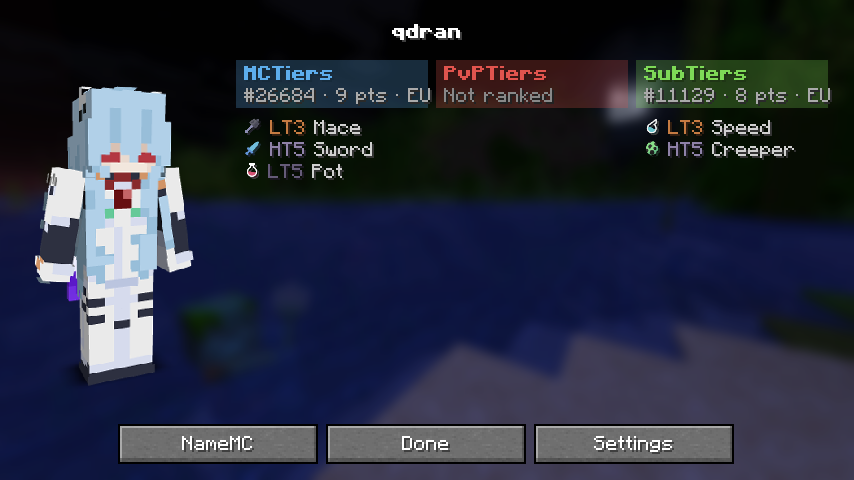

# QTiers

A Fabric client mod for **Minecraft 1.21.11**. It shows **MCTiers**, **PvPTiers** and **SubTiers** rankings together next to player names. It works like TierTagger, but for all three sites at once.

```
⚔HT3 | Steve | 🔮LT2 ⛏HT4
 MCTiers        PvPTiers SubTiers
```



## Features
- **All 3 sites at once** in nametags and the tab list. Put each site on the **left** or **right** of the name, or turn it **off**.
- **Player profile screen** (`/qtiers <player>`): a full-body skin render, plus every tier, peak, points, rank and region from all 3 sites. It has a button to open the player's NameMC page.
- **A separate gamemode for each site**, or **Highest**. Fallback rules match TierTagger: *Never*, *If not ranked in mode*, or *Always*.
- **Gamemode icons** (from TierTagger) and **MCTiers' tier colors** (HT1 gold, HT2 silver, HT3 bronze, and so on). Retired tiers show as `RHT1` in light blue.
- **Open the nearest player's profile** with **H**.
- **In-game settings**: `/qtiers`.

## Commands
- `/qtiers <player>`: open that player's profile screen. Online names tab-complete.
- `/qtiers` or `/qtiers settings`: open settings
- `/qtiers reload`: reload the config and refetch tiers

## Keybinds (Options → Controls → QTiers)
| Action | Default |
|---|---|
| Open nearest player's tiers | H |
| Cycle MCTiers / PvPTiers / SubTiers gamemode | unbound |
| Toggle QTiers | unbound |
| Open settings | unbound |

## Install
Put `qtiers-1.0.0.jar` and **Fabric API** in `.minecraft/mods`. You need Fabric Loader 0.16 or newer.

## Build
```
gradlew build
```
The jar is written to `build/libs/`.

## Credits
- Gamemode icon textures: [TierTagger](https://github.com/mctiers-dev/TierTagger) by MCTiers, MPL-2.0. See `assets/qtiers/textures/LICENSE-TierTagger-icons.txt`.
- Tier colors: from the mctiers.com stylesheet.
- Skin renders: [Visage](https://visage.surgeplay.com), with [mc-heads](https://mc-heads.net) as the fallback.
- The layout idea and profile screen come from [PvPTiers/Tiers](https://github.com/PvPTiers/Tiers). This mod contains none of its code.
